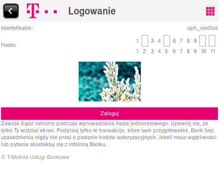

.. _authentication:

****************
Uwierzytelnianie
****************

W tym dokumencie opiszemy formy uwierzytelniania, z szczególnym uwzględnieniem dwuskładnikowego uwierzytelniania. Założenia leżące u jego podstaw, korzyści, ryzyko, ograniczenia, a także przeanalizujemy formy dwuskładnikowego dokonując analizy ich słabych i mocnych stron.

W tym rozdziale zostaną także przedstawine doświadczenia autora uzyskane w ramach projektu Koła Naukowego Programistów "Geek" polegającej na stworzeniu i rozwoju strony internetowej `Dwa-Skladniki.pl`_. Zostaną one przedstawione w formie analizy dotychczas wykorzystywanych w Polsce form uwierzytelniania. Zostanie przedstawiona analiza odnosząca się do sektora publicznego, jak również prywatnego, w tym perspektyw rozwoju w sektorze bankowości, który - obecnie - wytycza trendy.

.. _Dwa-Skladniki.pl: https://dwa-skladniki.pl/

.. _authentication_intro:

Uwagi wstępne
*************

Na samym wstępie niniejszych rozważań konieczne jest uporządkowanie terminologii. Pragnę w tym miejscu bezpośrednio odwołać się do do literatury przedmiotu [#f1]_ :

    Usługi elektroniczne zakładające interakcję z użytkownikiem wymagają zwykle identyfikacji użytkownika i jego uwierzytelnienia. Zgodnie z terminologią, identyfikację rozumie się jako nadanie (przypisanie) identyfikatora do osoby oraz deklarację (stwierdzenie) tożsamości osoby poprzez przedstawienie indentyfikatora. Taki identyfikator jednoznacznie tą osobę identyfikuje i stanowi elektroniczną tożsamość użytkownika w tymże środowisku. Sama identyfikacja pozwala zatem na stwierdzenie „o kogo chodzi”, ale nie potwierdza, że użytkownik danej e-usługi jest faktycznie tą osobą, która została zadeklarowana i zidentyfikowana. Do tego potwierdzenia służy właśnie uwierzytelnienie, polegające na dostarczeniu dowodów, że użytkownik jest właśnie tą zidentyfikowaną osobą (nikt się nie podszywa). W szczególnych przypadkach identyfikacja i uwierzytelnienie może przebiegać jednocześnie (np. gdy nasz identyfikator jest tajny, stanowiąc jednocześnie „hasło”), ale zasadniczo są to dwa różne procesy. Z kolei pod pojęciem autoryzacji (często mylonej z uwierzytelnieniem i niepoprawnie nazywanej „autentykacją”) rozumie się proces nadania określonych uprawnień, z których następnie poprawnie zidentyfikowana i uwierzytelniona osoba będzie mogła korzystać.

W dalszych rozważaniach będzie wykorzystywana następująca klasyfikacja form uwierzytelniania:

* coś co wiesz (*something you know*) – informacja będąca w wyłącznym posiadaniu uprawnionego podmiotu, na przykład hasło lub klucz prywatny;
* coś co masz (*something you have*) – przedmiot będący w posiadaniu uprawnionego podmiotu, na przykład generator kodów elektronicznych (token), telefon komórkowy (kody SMS, połączenie autoryzacyjne) lub klucz analogowy,
* coś czym jesteś (*something you are*) – metody biometryczne.

.. todo:: Zapoznać się z:

    * https://pages.nist.gov/800-63-3/sp800-63b.html DRAFT NIST Special Publication 800-63B Digital Authentication Guideline
    * wyjaśnić hasło "Bring Your Own Authentication (BYOA)""
    * https://sekurak.pl/kompendium-bezpieczenstwa-hasel-atak-i-obrona/

.. _password_policy:

Hasło
*****
W przypadku wielu systemów komputerowych do uwierzytelniania wykorzystywane jest wyłącznie hasło. Jest najpopularniejszą formę uwierzytelniania i w ocenie autora najmniej bezpieczną. Stanowi formę uwierzytelniania typu *coś co wiesz*. 

W przypadku wykorzystania wyłącznie tej formy uwierzytelniania proces logownia w systemie komputerowym polega na wprowadzeniu loginu i hasła użytkownika. W związku z ograniczonym bezpieczeństwem tej formy uwierzytelniania wdrażane są w systemach komputerowych liczne metody, które mają ograniczyć jej wady. Podejmowane są działania zarówno na poziomie organizacyjnym, a także technicznym, które mają ograniczyć jej słabości.

.. seqdiag::
   :desctable:
   :caption: Podstawowe uwierzytelnienie hasłem

   seqdiag {
      A -> B -> C [label="nowe hasło"];
      D -> C [label="stare hasło"];
      C -> C [label="porównanie haseł"];
      C -> B [label="wynik weryfikacji"]
      A [description = "użytkownik"];
      B [description = "przeglądarka"]
      C [description = "aplikacja"];
      D [description = "baza danych"];
   }

Na poziomie technicznym wprowadzone jest tzw. *hashowanie* haseł. Polega ono na ograniczeniu dostępności w systemie komputerowmy hasła w postaci jawnej poprzez zapisanie wyłącznie danych stanowiących wynik jednokierunkowej funkcji skrótu określany jako *hash*. Wówczas proces uwierzytelniania polega na porównaniu danych stanowiących wynik funkcji. Można to przedstawić następująco:

.. seqdiag::
   :desctable:
   :caption: Uwierzytelnianie hasłem z wykorzystaniem funkcji skrótu

   seqdiag {
      A -> B -> C [label="nowe hasło"];
      C -> C [label= "nowe hasło -> nowy hash"];
      D -> C [label="stary hash"];
      C -> C [label="porównanie hashy"];
      C -> B [label="wynik weryfikacji"]
      A [description = "użytkownik"];
      B [description = "przeglądarka"]
      C [description = "aplikacja"];
      D [description = "baza danych"];
   }

Dzięki wykorzystaniu funkcji skrótu zostało ograniczone ryzyko, że po włamaniu do bazy danych użytkownik będzie od razu zagrożony [#f_dropbox]_. Wykorzystanie takich danych wymaga odnalezienie kolizji, co wymaga bardzo wielu obliczeń. W wielu wypadkach zastosowanie funkcji skrótu zwiększa zasoby wymaganie do wykorzystania danych, ale tego nie uniemożliwia.

Zagrożeniem dla uwierzytelniania hasłem jest rownież przesyłanie hasła w postaci jawnej poprzez sieć. Aby się przed tym zabezpieczyć wykorzystywane są różnorodne algorytmy szyfrowania komunikacji np. HTTPS. Okazują się jednak one nieskuteczne, jeżeli hasło zostanie podsłuchane pomiedzy użytkownikiem, a przeglądarką np. na skutek wykorzystania `keyloggerów`. Zabezpieczenie hasła przed tym wymaga podejmowania znacznych nakładów na zabezpieczenie urządzeń użytkownika.

W aspekcie technicznym podejmowane są działania, które mogą ograniczyć skuteczność keyloggerów. Należą w tym zakresie m. in. hasła maskowane, które polegają na oczekiwaniu od użytkownika jednorazowo tylko wybranych znaków z hasła i z każdą zmianą zmienianie tego zestawu znaków. W takiej sytuacji nie jest wystarczające jednorazowe podsłuchanie wprowadzonych danych, gdyż podczas kolejnego uwierzytelniania wymagane będzie inny zestaw znaków.

    Przykładowy ekran uwierzytelniania z wykorzystaniem hasła maskowanego (T-Mobile Usługi bankowe, styczeń 2016 roku) (opr. własne)

Polityki haseł
--------------

W zakresie organizacyjnym, który często wspierany jest także odpowiednimi rozwiązaniami technicznymi wprowadzone są polityki haseł. Obejmują one najczęsciej zagadnienia dotyczącego ponownego wykorzystania tych samych haseł w tym i innych systemach komputerowych, złożoność haseł i częstotliwość ich zmiany.

Warto w tym miejscu dostrzec, że nieadekwatna polityka haseł może prowadzić do ograniczenia bezpieczeństwa, a nie jego poprawy. Moim zdaniem dotyczy to w szczególności wymogu częstej zmiany haseł bez wdrożenia alternatywnych rozwiązań. Częsta zmiana haseł rodzi kilka zasadniczych problemów. Nie wszyscy posiadają zdolność zapamiętania złożonych haseł, co prowadzi do ponownego używania haseł w wielu miejscach lub stosowania haseł schematycznych z wykorzystaniem prostych transformacji. W takim wypadku zbyt skomplikowane i często zmieniane hasła prowadzą do zapisywania ich w jawnej formie, co może narażać na ich kradzież.

Odnośnie schematycznych haseł warto w tym miejscu dostrzec uwagi Lorrie Cranor z amerykańskiej Federalnej Komisji Handlu (FTC), która opisała na stronie FTC badania przeprowadzone na University of North Carolina (w Chapel Hill). Badacze pozyskali ponad 51 tys. hashy haseł do 10 tys. nieaktywnych kont studentów i pracowników, na których wymuszano zmianę hasła co 3 miesiące. Po ich analizie stwierdzono, że dla 17% kont znajomość poprzedniego hasła pozwalała na zgadnięcie kolejnego hasła w mniej niż 5 próbach [#f7]_ [#f8]_.

Podobne wątpliwości co do skuteczności polityki zmiany haseł wyrażono w badaniach tego problemu przeprowadzonych na Carleton University [#f9]_ . Dostrzeżono w nich, że w przypadku wielu ataków jednorazowy dostęp do systemu umożliwia natychmiastowe pozyskanie plików docelowych, założenie tylnych drzwi, zainstalowanie  oprogramowania typu keylogger lub innego trwałego, złośliwego oprogramowania, które późniejsze zmiany hasła uczyni nieskutecznymi. Autorzy nawet stawiają tezę, że prawdziwe korzyści z wymuszania zmiany haseł nie rekompensują związanych z tym uciążliwości.

Sytuacja ta oznacza, że nie można wprowadzić generalnej reguły, która uzasadniałaby określoną politykę haseł, wymaga to każdorazowo indywidualnej analizy administratora systemu komputerowego.

Powyższa analiza pokazuje tylko niektóre z słabości uwierzytelniania z wykorzystaniem haseł i uzasadnia konieczność poszukiwania bezpieczniejszych form uwierzytelniania.

.. _2factor:

Dwuskładnikowe uwierzytelnienie
*******************************

W nowoczesnych systemach komputerowych przed uzyskaniem dostępu często stosuje się jednak uwierzytelniani wieloskładnikowe (*multi-factor authentication*), w szczególności dwuskładnikowe (*two-factor authentication*), czyli łączące dwie różne metody uwierzytelniania.

Jest to praktykowane, ponieważ w komunikacji elektronicznej stosowanie samego hasła wiąże się z różnego rodzaju ryzykiem, a wykorzystanie kilku form uwierzytelnienia może ograniczać skutki przechwycenia (keylogger), albo podsłuchania (sniffer) hasła po którym przestaje ono być wówczas znane wyłącznie osobie uprawnionej, zaś kradzież może pozostać niezauważona. Ryzyko to można ograniczyć, wprowadzając dodatkowy składnik uwierzytelniania wykorzystując kilka form autoryzacji jednocześnie np.:

* token istniejący w jednym, unikatowym egzemplarzu, więc jego użycie wymaga fizycznego dostępu lub kradzieży, która zostanie zauważona (cecha coś co masz);
* użycie tokenu wymaga dodatkowo podania hasła (np. w postaci kodu PIN), więc bez jego znajomości token będzie nieprzydatny, nawet w razie kradzieży (cecha coś co wiesz).

Uwierzytelnienie dwuskładnikowe stosuje większość banków internetowych, usługa poczty Gmail, Facebook, Apple, platformy gier (Battle.net) i wiele innych. Powszechnie dostępne są interfejsy programistyczne do jednorazowych haseł przesyłanych za pomocą SMS, tokeny sprzętowe, jak i programowe generatory haseł TOTP (Time-based One-Time Password Algorithm) np. Google Authenticator.

Warto zwrócić uwagę, że standardy regulacyjne dotyczące dostępu do systemów rządu federalnego USA wymagają nawet używania uwierzytelniania wieloskładnikowego, aby uzyskać dostęp do krytycznych zasobów IT, na przykład podczas logowania do urządzeń sieciowych podczas wykonywania zadań administracyjnych oraz przy dostępie do uprzywilejowanego konta. Również publikacja „The Critical Security Controls for Effective Cyber Defense”, wydana przez instytut SANS, przygotowana przez rządowe agencje i komercyjnych ekspertów śledczych i d/s bezpieczeństwa stanowczo zaleca wykorzystanie takich rozwiązań [#f2]_.

.. rubric:: Footnotes

.. [#f1] Tomasz Mielnicki, Franciszek Wołowski, Marek Grajek, Piotr Popis, Identyfikacja i uwierzytelnianie w usługach elektronicznych, Przewodnik Forum Technologii Bankowych przy Związku Banków Polskich, Warszawa, 2013, http://zbp.pl/public/repozytorium/dla_bankow/rady_i_komitety/technologie_bankowe/publikacje/Przewodnik_Identyfikacja_i_uwierzytelnianie_strona_FTB.pdf [dostęp 23 grudnia 2016 roku]

.. [#f2] CIS Controls for Effective Cyber Defense Version 6.0, SANS Institute, https://www.cisecurity.org/critical-controls.cfm [dostęp 16 marca 2016 roku]

.. [#f7] Lorrie Cranor, Time to rethink mandatory password changes, 2 marca 2016 roku, Federalna Komisja Handlu, ftc.gov, https://www.ftc.gov/news-events/blogs/techftc/2016/03/time-rethink-mandatory-password-changes [dostęp 16 marca 2016 roku]

.. [#f8] Brian Barrett, Want Safer Passwords? Don’t Change Them So Often, Wired.com 3.10.2016, http://www.wired.com/2016/03/want-safer-passwords-dont-change-often/ [dostęp 16 marca 2016 roku]

.. [#f9] Sonia Chiasson, P. C. van Oorschot, Quantifying the security advantage of password expiration policies, Designs, Codes and Cryptography, 2015, Volume: 77, Issue 2-3, 401-4

.. [#f_dropbox] Devdatta Akhawe, How Dropbox securely stores your passwords, Dropbox Tech blog, https://blogs.dropbox.com/tech/2016/09/how-dropbox-securely-stores-your-passwords/ [dostęp 2 stycznia 2016 roku]
